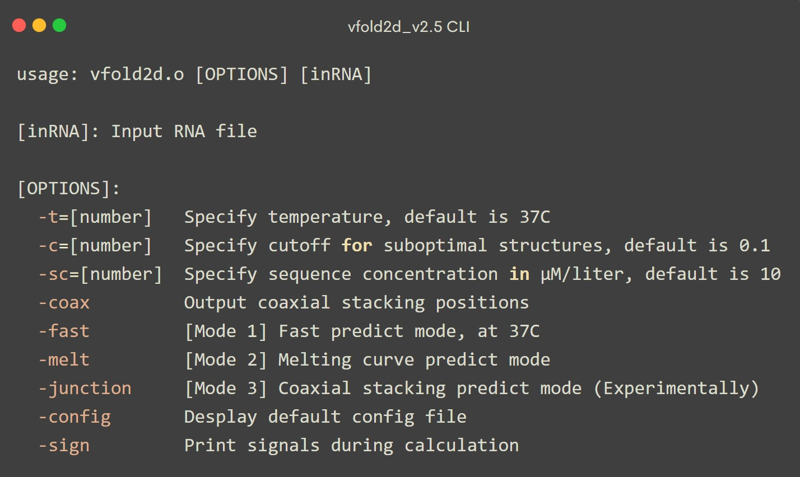
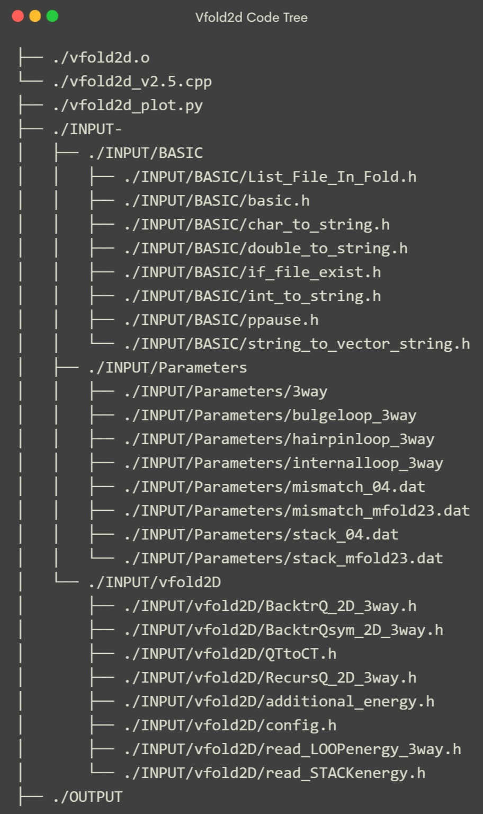
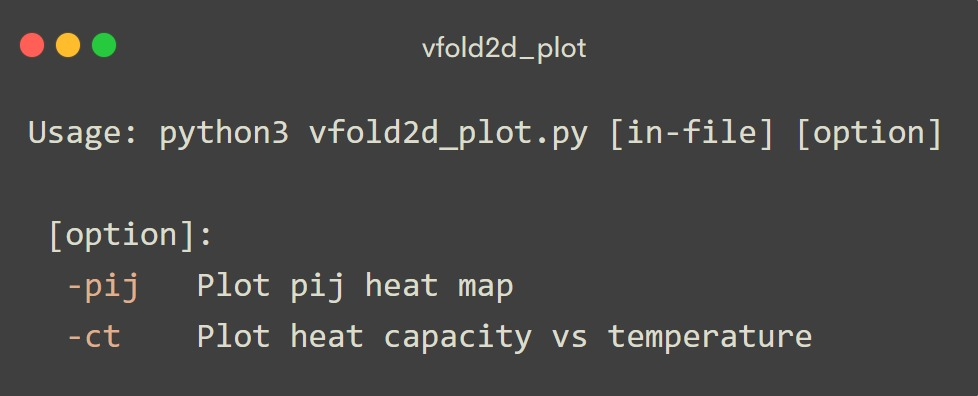
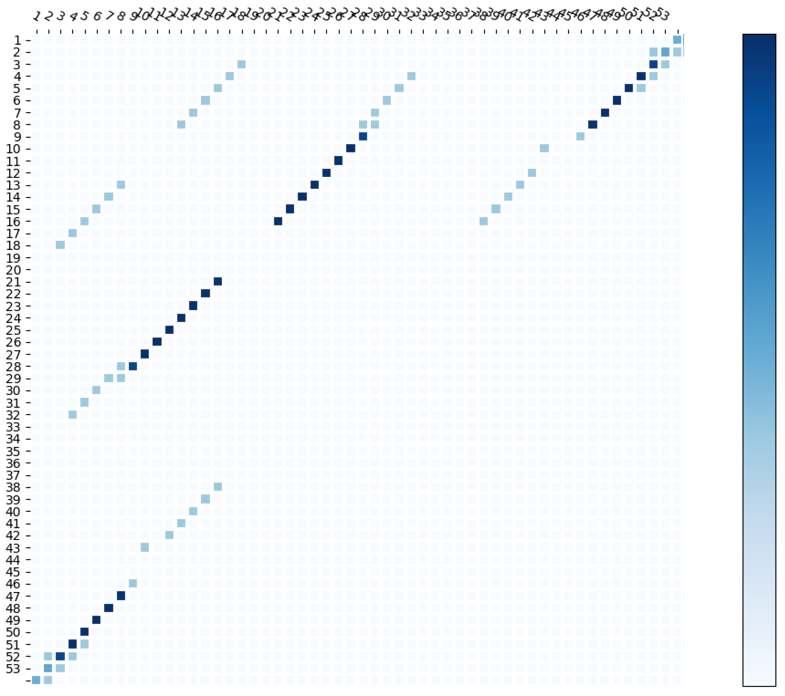
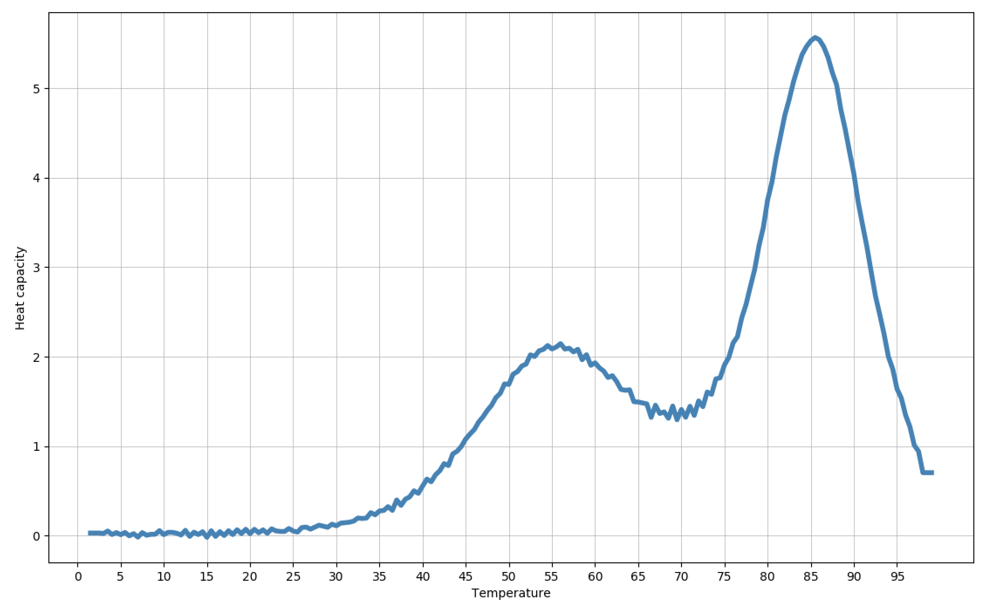

# Vfold2d (version 2.5) Overview

<small> 2019-11 , Sicheng Zhang </small>

<br>

---

- [Vfold2d (version 2.5) Overview](#vfold2d--version-25--overview)
  * [Command Line Interface](#command-line-interface)
  * [Predict Under Multiple Options](#predict-under-multiple-options)
    + [Default mode](#default-mode)
    + [Fast mode](#fast-mode)
    + [Melting curve predict mode](#melting-curve-predict-mode)
    + [Coaxial stacking predict mode](#coaxial-stacking-predict-mode)
    + [Specify parameters](#specify-parameters)
  * [Code Tree](#code-tree)
  * [Configuration File](#configuration-file)
- [vfold2d_plot](#vfold2d-plot)


---


**Vfold2d_v2.5** (version 2.5) combines several RNA secondary structure  prediction tools in a single package. Through a simple command line interface, vfold2d_v2.5 package could run in four modes while letting users specify several parameters. Details are given below.

+ **Default mode**

  - predict RNA 2D structures from single stranded sequence

  - show 2-way and multiple way junction stacking positions for all output structures

    

+ **Fast predict mode**

  - fast predict RNA 2D minimum free energy structure at 37 C

  

+ **Melting curve predict mode**

  - calculate heat capacity and partition function at temperature from 1 to 100 Celsius

  

+ **Coaxial stacking predict mode**

  - predict coaxial stacking for a given junction

    

+ User could easily specify:
  - temperature
  - suboptimal structure cutoff
  - sequence concentration, for melting curve predict
  - and more parameters from configuration file

<br><br><br><br>

---


## Command Line Interface




---

## Predict Under Multiple Options

### Default mode

+ Input

    ```bash
    ./vfold2d.o inRNA.seq
    ```

	If no options applied, vfold2d will run under settings stored in `config.h` file, at **37** Celsius temperature, cutoff will be **0.1**.
	
	
	
	`inRNA.seq` example:
	
	```txt
	UUGCCAUGUGUAUGUGGGCCCACAUACUUUGUUGAUCCGGAUCAAUCAU
	.................................................
	```
	
	
	
+ Output

    
  
    Output files in `/OUTPUT/` folder, including `.pij` file and `.sym` file.
    
    
    
+ To show 2-way and multiple way junction stacking positions for all output structures, use option `-coax`. Coaxial stacking positions will shown in `.sym` file. For example:
  
    ```bash
    ./vfold2d.o inRNA.seq -coax
    ```

<br>

### Fast mode

+ Input

  ```bash
  ./vfold2d.o inRNA.seq -fast
  ```

+ Output

  
  
  Output files in `/OUTPUT/` folder, only generate  `.sym` file.
  
  
  
+ Priority higher than all other modes

<br>

### Melting curve predict mode

+ Input

  ```bash
  ./vfold2d.o inRNA.seq -melt
  ```

+ Output

  
  
  Output files in `/OUTPUT/` folder, including `QT.txt` for partition function, `CT.txt` for heat capacity at temperature range from 1 to 100 Celsius.

<br>


### Coaxial stacking predict mode

+ Input

  ```bash
  ./vfold2d.o inRNA.junc -junction
  ```

  `.junc` file should only include nucleotides in junction, and specify helix positions by character `j` or `J`. For example: 

  ```txt
  gGUgcUUUAcgAc
  ...J.....J...
  ```

+ Output

  Results will be displayed in terminal after calculation, won't generate files. Result will be like `0 0 0 0 1 ... 0 ` . Zero for no stacking, one for stacking.


### Specify parameters

+ `-t` for specifying temperature. Temperature at 70 Celsius for example:

  ```bash
  ./vfold2d.o inRNA.seq -t=70
  ```

+ `-c` for specifying suboptimal structures cutoff. Cutoff at 0.5 for example:

  ```bash
  ./vfold2d.o inRNA.seq -c=0.5
  ```

+ `-sc` for specifying sequence initial concentration. Concentration at 100 μM for example:

  ```bash
  ./vfold2d.o inRNA.seq -sc=100 -melt
  ```

+ Multiple options are available, vfold2d package will take last one if duplicate. For example, following command will apply 90 Celsius temperature and 0.3 cutoff:

  ```bash
  ./vfold2d.o inRNA.seq -t=20 -t=30 -c=0.5 -c=0.6 -t=90 -c=0.3
  ```


+ User could modify configuration file to specify more parameters, such as max length of sequence. `-config` option could display the path of `config.h` file:

  ```bash
  ./vfold2d.o -config
  ```

---

## Code Tree




Important files & paths:

+ `vfold2d.o` - executable file

+ `vfold2d_plot.py` - python script for fast plotting Pij heat map and melting curve

+ `vfold2d_v2.5` - main source code, in C++

+ `./INPUT/BASIC/` - source code for several basic functions

+ `./INPUT/Parameters/` - energy parameters

+ `./INPUT/vfold2D/` - source code for recursive and backtracking algorithms

  

<br>

---

## Configuration File

Default configurations are stored in `config.h` file under `INPUT/vfold2d` path. Following are several important default parameters:

| Parameters       | Default value | Meaning                        |
| ---------------- | ------------- | ------------------------------ |
| `INPUT`          | ./INPUT/      | input path                     |
| `OUTPUT`         | ./OUTPUT/     | ouput path                     |
| `TTC`            | 37            | temperature                    |
| idcoax           | 1             | with/without coaxial energy    |
| BacktrSym_cutoff | 0.1           | suboptimal structures cutoff   |
| `type`           | 0             | energy parameters type         |
| `sign`           | 0             | with/without signatures output |


<br><br><br>

---

# vfold2d_plot

`vfold2d_plot.py` is an independent python script for fast generating plots of Pij and melting curve. Usage: 





+ `vfold2d_plot.py` requires the following dependencies:

  

  - Python3
  - matplotlib
  - pandas
  - numpy


+ Pij heat map example:

  ```bash
  python3 vfold2d_plot.py output.pij -pij
  ```

  

  

  

  

+ Melting curve plot example:

  ```bash
  python3 vfold2d_plot.py CT.txt -ct
  ```
  
  

